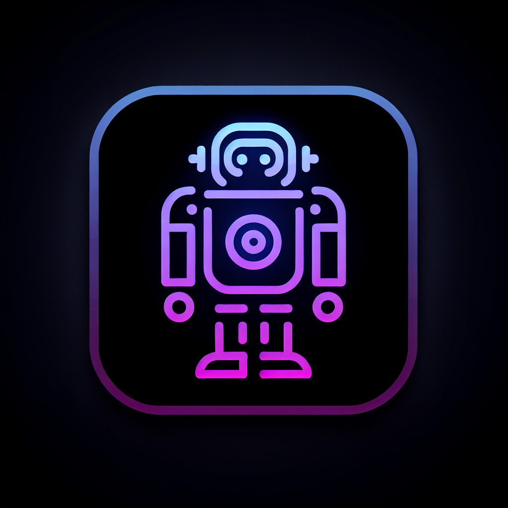

# GridVid: AI Video Generation on LUKSO



GridVid is a decentralized mini-app for the LUKSO blockchain that enables users to generate AI-powered videos from text prompts. The platform integrates Google's Veo 2 model for state-of-the-art video generation with LUKSO's Universal Profile for identity and payments.

## Features

- **Universal Profile Integration**: Connect seamlessly with LUKSO UP Browser Extension
- **Text-to-Video Generation**: Generate high-quality videos from text prompts
- **Variable Duration**: Choose video length (5-8 seconds) with dynamic pricing
- **Multiple Aspect Ratios**: Support for both 16:9 (landscape) and 9:16 (portrait) videos
- **Decentralized Storage**: All videos stored permanently on IPFS
- **Ethical Safeguards**: Content moderation to prevent generation of inappropriate content
- **LUKSO Payment**: Pay with LYX tokens ($0.35 USD per second, converted to LYX)
- **Blockchain Verification**: Multi-step transaction verification process

## Technical Stack

- **Frontend**: React.js, TypeScript, Shadcn/UI, Tailwind CSS
- **Backend**: Node.js, Express.js
- **AI**: Google Generative AI (Veo 2 model)
- **Blockchain**: LUKSO Testnet, UP Provider, Viem
- **Storage**: IPFS via Pinata
- **Validation**: Zod
- **Build Tools**: Vite

## Prerequisites

To run this project, you need:

1. Node.js (v16+)
2. LUKSO UP Browser Extension
3. Access to Google Generative AI API (API key required)
4. Pinata IPFS account (API key, Secret, and JWT required)
5. LYX tokens on LUKSO Testnet

## Environment Variables

Create a `.env` file with the following variables:

```
GOOGLE_API_KEY=your_google_api_key
PINATA_API_KEY=your_pinata_api_key
PINATA_SECRET_KEY=your_pinata_secret
PINATA_JWT=your_pinata_jwt
COINMARKETCAP_API_KEY=your_coinmarketcap_api_key
```

## Installation

```bash
# Install dependencies
npm install

# Start the development server
npm run dev

# For production
npm run build
npm start
```

## Usage Flow

1. **Connect Wallet**: Click the Connect button in the top-right to link your Universal Profile
2. **Enter Prompt**: Type your text prompt for video generation
3. **Select Options**: Choose aspect ratio and video duration
4. **Pay**: Send LYX to cover the video generation cost
5. **Wait**: The video typically takes about 1 minute to generate
6. **Enjoy**: Download your AI-generated video or view it directly in the app

## Architecture

The application follows a modular architecture:

- **Client**: React frontend with TypeScript for type safety
- **Server**: Express.js backend handling video generation and IPFS storage
- **Workflow**: Step-based user journey from connection to result
- **Storage**: In-memory storage with IPFS integration for decentralized content

## LUKSO LSP Integration

- **Universal Profile**: Authentication through LSP0/LSP3
- **Payments**: LYX transfers using UP Provider
- **Metadata Storage**: Video metadata can be stored in UP for future discovery

## License

[MIT License](LICENSE)

## Contact

For questions or support, please create an issue in this repository.